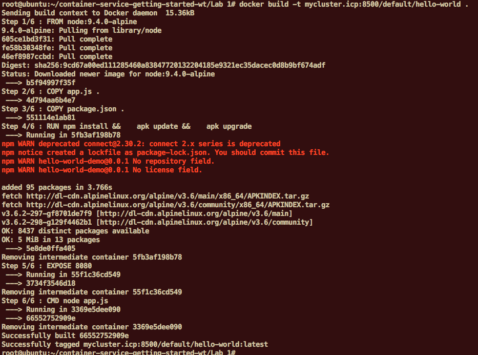
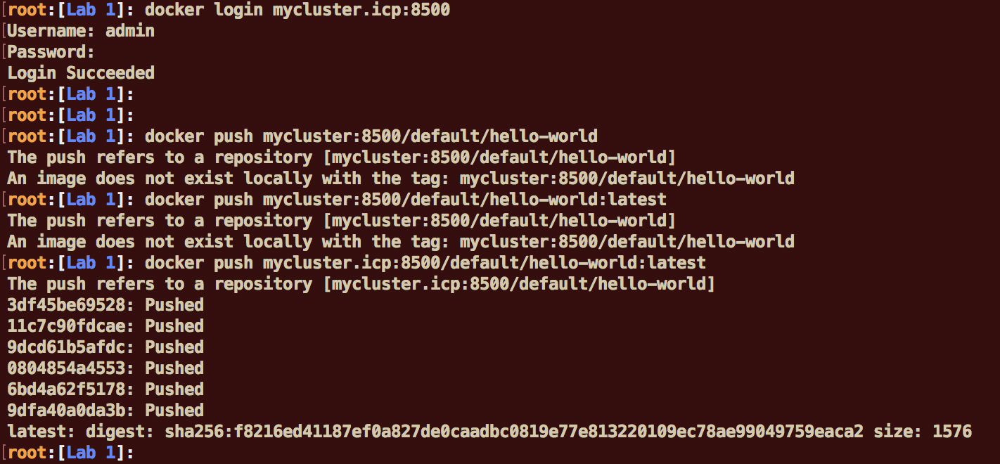
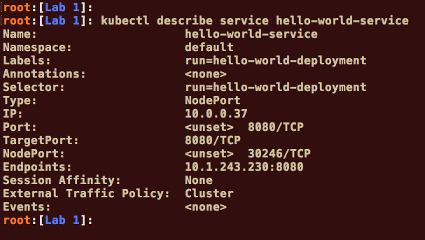

<div style="background-color:black;color:white; vertical-align: middle; text-align:center;font-size:250%; padding:10px; margin-top:100px"><b>
IBM Cloud Private - Kubernetes Lab
 </b></a></div>


### Table of Contents

---

- [Task 1 : Deploying Apps with Kubernetes](#task-1---deploying-apps-with-kubernetes)
    + [1. Login to Ubuntu VM as **root** using SSH or Putty.](#1-login-to-ubuntu-vm-as---root---using-ssh-or-putty)
    + [2.Modify your hosts file on your laptop](#2modify-your-hosts-file-on-your-laptop)
    + [3. Download a GIT repo for this exercise](#3-download-a-git-repo-for-this-exercise)
    + [4. Build a Docker image](#4-build-a-docker-image)
    + [6. Log in to the cluster and push the image to the registry.](#6-log-in-to-the-cluster-and-push-the-image-to-the-registry)
    + [7. View your image in the console](#7-view-your-image-in-the-console)
    + [8. Run your first deployment](#8-run-your-first-deployment)
    + [9. Expose your first service](#9-expose-your-first-service)
    + [10. Identify the NodePort](#10-identify-the-nodeport)
    + [11. the NodePort number is `30246`.](#11-the-nodeport-number-is--30246-)
    + [12. Cluster resources](#12-cluster-resources)
- [Task 2 : Scaling Apps with Kubernetes](#task-2---scaling-apps-with-kubernetes)
    + [1. Clean up the current deployment](#1-clean-up-the-current-deployment)
    + [2. Run a clean deployment](#2-run-a-clean-deployment)
    + [3. Scale the application](#3-scale-the-application)
    + [4. Rollout an update to  the application](#4-rollout-an-update-to--the-application)
    + [5. Check the health of apps](#5-check-the-health-of-apps)
    + [End of the lab](#end-of-the-lab)


---


# Task 1 : Deploying Apps with Kubernetes


### 1. Login to Ubuntu VM as **root** using SSH or Putty. 

Also test your connectivity to the cluster with this command:

 `kubectl get nodes`

If you get an error, execute the following script that we created in the installation lab :

`~/connect2icp.sh`


### 2.Modify your hosts file on your laptop

On your machine (your laptop or your desktop), modify your **hosts** file so that you can access the master:
    
Edit the hosts file and add the following line at the end (replace the ipaddress with yours) :    
```
    ...     
    111.222.333.444	mycluster.icp
```
    

### 3. Download a GIT repo for this exercise

`git clone https://github.com/IBM/container-service-getting-started-wt.git`
	


### 4. Build a Docker image 

Build the image locally and tag it with the name that you want to use on the IBM Cloud Private kubernetes cluster. The tag includes the namespace name of `default` in the cluster. The tag also targets the master node of the cluster, which manages the job of placing it on one or more worker nodes. This is because of the alias you created in the previous step, with the cluster name linked to the master node name. The communications with the master node happen on port 8500. Tagging the image this way tells Docker where to push the image in a later step. Use lowercase alphanumeric characters or underscores only in the image name. Don't forget the period (.) at the end of the command. The period tells Docker to look inside the current directory for the Dockerfile and build artifacts to build the image.

`cd "container-service-getting-started-wt/Lab 1"`

`docker build -t mycluster.icp:8500/default/hello-world .`



To see the image, use the command:

`docker images mycluster.icp:8500/default/hello-world:latest`

### 6. Log in to the cluster and push the image to the registry. 

Log in as user `admin` with password `admin`.

`docker login mycluster.icp:8500`
    
`docker push mycluster.icp:8500/default/hello-world`
 
 Your output should look like this.




### 7. View your image in the console

Open a browser to https://mycluster.icp:8443. 

Change the ip address depending on you hosts file. Create a security exception in your browser for this location and if necessary, click on the `Advanced` link and follow the prompts. Log in as user `admin` with password `admin`. 

View your image using `Menu > Manage > Images`.


### 8. Run your first deployment

Use your image to create a kubernetes deployment with the following command.

`kubectl run hello-world-deployment --image=mycluster.icp:8500/default/hello-world`
  


### 9. Expose your first service

Create a service to access your running container using the following command.

`kubectl expose deployment/hello-world-deployment --type=NodePort --port=8080 --name=hello-world-service --target-port=8080`
 
  
Your output should be:


### 10. Identify the NodePort

With the NodePort type of service, the kubernetes cluster creates a 5-digit port number to access the running container on through the service. 

The service is accessed through the IP address of the proxy node on the NodePort port number. To discover the NodePort number that has been assigned, use the following command.

`kubectl describe service hello-world-service`

 Your output should look like this.

 


### 11. the NodePort number is `30246`. 

Yours may be different. Open a Firefox browser window or tab and go to the URL of your master node with your NodePort number, such as `http://mycluster.icp:30246`. Your output should look like this.

 
 

### 12. Cluster resources

You can view much of the information on your cluster resources visually through the IBM Cloud Private console, similar to information you might have viewed in the Kubernetes Dashboard. That is the subject of our next demo. As an alternative, you can obtain text-based information on all the resources running in your cluster using the following command.

`kubectl describe all`
 

    The amount of output is too large to list here.

Congratulations! You have deployed your first app to the IBM Cloud Private kubernetes cluster.


# Task 2 : Scaling Apps with Kubernetes

In this lab, understand how to update the number of replicas a deployment has and how to safely roll out an update on Kubernetes. Learn, also, how to perform a simple health check.

For this lab, you need a running deployment with a single replica. First, we cleaned up the running deployment.

### 1. Clean up the current deployment

To do so, use the following commands :
- To remove the deployment, use:
 
`kubectl delete deployment hello-world-deployment`
- To remove the service, use: 

`kubectl delete service hello-world-service`

### 2. Run a clean deployment

To do so, use the following commands :

`kubectl run hello-world --image=mycluster.icp:8500/default/hello-world`

### 3. Scale the application

A replica is how Kubernetes accomplishes scaling out a deployment. A replica is a copy of a pod that already contains a running service. By having multiple replicas of a pod, you can ensure your deployment has the available resources to handle increasing load on your application.

kubectl provides a scale subcommand to change the size of an existing deployment. Let's us it to go from our single running instance to 10 instances.

`kubectl scale --replicas=10 deployment hello-world`

Here is the result:
```
$ kubectl scale --replicas=10 deployment hello-world
deployment "hello-world" scaled
```

Kubernetes will now act according to the desired state model to try and make true, the condition of 10 replicas. It will do this by starting new pods with the same configuration.

To see your changes being rolled out, you can run: 

`kubectl rollout status deployment/hello-world`

The rollout might occur so quickly that the following messages might not display:
```
$ kubectl rollout status deployment/hello-world
Waiting for rollout to finish: 1 of 10 updated replicas are available...
Waiting for rollout to finish: 2 of 10 updated replicas are available...
Waiting for rollout to finish: 3 of 10 updated replicas are available...
Waiting for rollout to finish: 4 of 10 updated replicas are available...
Waiting for rollout to finish: 5 of 10 updated replicas are available...
Waiting for rollout to finish: 6 of 10 updated replicas are available...
Waiting for rollout to finish: 7 of 10 updated replicas are available...
Waiting for rollout to finish: 8 of 10 updated replicas are available...
Waiting for rollout to finish: 9 of 10 updated replicas are available...
deployment "hello-world" successfully rolled out
````

Once the rollout has finished, ensure your pods are running by using: kubectl get pods.

You should see output listing 10 replicas of your deployment:

`kubectl get pods`

Here is the result:
```
NAME                          READY     STATUS    RESTARTS   AGE
hello-world-562211614-1tqm7   1/1       Running   0          1d
hello-world-562211614-1zqn4   1/1       Running   0          2m
hello-world-562211614-5htdz   1/1       Running   0          2m
hello-world-562211614-6h04h   1/1       Running   0          2m
hello-world-562211614-ds9hb   1/1       Running   0          2m
hello-world-562211614-nb5qp   1/1       Running   0          2m
hello-world-562211614-vtfp2   1/1       Running   0          2m
hello-world-562211614-vz5qw   1/1       Running   0          2m
hello-world-562211614-zksw3   1/1       Running   0          2m
hello-world-562211614-zsp0j   1/1       Running   0          2m
```

### 4. Rollout an update to  the application

Kubernetes allows you to use a rollout to update an app deployment with a new Docker image. This allows you to easily update the running image and also allows you to easily undo a rollout, if a problem is discovered after deployment.

In the previous lab, we created an image with a 1 tag. Let's make a version of the image that includes new content and use a 2 tag. This lab also contains a Dockerfile. Let's build and push it up to our image registry.

If you are in "Lab 1" directory, you need to go to "Lab 2" directory:

`cd ../"Lab 2"`

Build a new version (2) of that application: 

`docker build --tag mycluster.icp:8500/default/hello-world:2 .`

Then push the new version into the registry:

`docker push mycluster.icp:8500/default/hello-world:2`

Using kubectl, you can now update your deployment to use the latest image. kubectl allows you to change details about existing resources with the set subcommand. We can use it to change the image being used.

`kubectl set image deployment/hello-world hello-world=mycluster.icp:8500/default/hello-world:2`

Note that a pod could have multiple containers, in which case each container will have its own name. Multiple containers can be updated at the same time. 

Run kubectl rollout status deployment/hello-world or kubectl get replicasets to check the status of the rollout. The rollout might occur so quickly that the following messages might not display:

`kubectl rollout status deployment/hello-world`

```
=> kubectl rollout status deployment/hello-world
Waiting for rollout to finish: 2 out of 10 new replicas have been updated...
Waiting for rollout to finish: 3 out of 10 new replicas have been updated...
Waiting for rollout to finish: 3 out of 10 new replicas have been updated...
Waiting for rollout to finish: 3 out of 10 new replicas have been updated...
Waiting for rollout to finish: 4 out of 10 new replicas have been updated...
Waiting for rollout to finish: 4 out of 10 new replicas have been updated...
Waiting for rollout to finish: 4 out of 10 new replicas have been updated...
Waiting for rollout to finish: 4 out of 10 new replicas have been updated...
Waiting for rollout to finish: 4 out of 10 new replicas have been updated...
Waiting for rollout to finish: 5 out of 10 new replicas have been updated...
Waiting for rollout to finish: 5 out of 10 new replicas have been updated...
Waiting for rollout to finish: 5 out of 10 new replicas have been updated...
Waiting for rollout to finish: 6 out of 10 new replicas have been updated...
Waiting for rollout to finish: 6 out of 10 new replicas have been updated...
Waiting for rollout to finish: 6 out of 10 new replicas have been updated...
Waiting for rollout to finish: 7 out of 10 new replicas have been updated...
Waiting for rollout to finish: 7 out of 10 new replicas have been updated...
Waiting for rollout to finish: 7 out of 10 new replicas have been updated...
Waiting for rollout to finish: 7 out of 10 new replicas have been updated...
Waiting for rollout to finish: 8 out of 10 new replicas have been updated...
Waiting for rollout to finish: 8 out of 10 new replicas have been updated...
Waiting for rollout to finish: 8 out of 10 new replicas have been updated...
Waiting for rollout to finish: 8 out of 10 new replicas have been updated...
Waiting for rollout to finish: 9 out of 10 new replicas have been updated...
Waiting for rollout to finish: 9 out of 10 new replicas have been updated...
Waiting for rollout to finish: 9 out of 10 new replicas have been updated...
Waiting for rollout to finish: 1 old replicas are pending termination...
Waiting for rollout to finish: 1 old replicas are pending termination...
Waiting for rollout to finish: 1 old replicas are pending termination...
Waiting for rollout to finish: 9 of 10 updated replicas are available...
Waiting for rollout to finish: 9 of 10 updated replicas are available...
Waiting for rollout to finish: 9 of 10 updated replicas are available...
deployment "hello-world" successfully rolled out
````

Finally, use that command to see the result:

`kubectl get replicasets`

```
=> kubectl get replicasets
NAME                   DESIRED   CURRENT   READY     AGE
hello-world-1663871401   0         0         0         1h
hello-world-3254495675   10        10        10        1m
```

Create a new service:

`kubectl expose deployment/hello-world --type=NodePort --port=8080 --name=hello-world-service --target-port=8080`

Take a note of the NodePort in the description. The NodePord is working against the public IP address of the worker node (in this case this is our unique **ipaddress**)

Perform a curl http://<public-IP>:<nodeport> to confirm your new code is active or open a browser and 


### 5. Check the health of apps

Kubernetes uses availability checks (**liveness probes**) to know when to restart a container. For example, liveness probes could catch a deadlock, where an application is running, but unable to make progress. Restarting a container in such a state can help to make the application more available despite bugs.

Also, Kubernetes uses readiness checks to know when a container is ready to start accepting traffic. A pod is considered ready when all of its containers are ready. One use of this check is to control which pods are used as backends for services. When a pod is not ready, it is removed from load balancers.

In this example, we have defined a HTTP liveness probe to check health of the container every five seconds. For the first 60 seconds, the /healthz returns a 200 response and will fail afterward. Kubernetes will automatically restart the service.

Open the **healthcheck.yml** file with a text editor. 

`nano healthcheck.yml`

This configuration script combines a few steps from the previous lesson to create a deployment and a service at the same time. App developers can use these scripts when updates are made or to troubleshoot issues by re-creating the pods:

Update the details for the image in your private registry namespace:

`image: "mycluster.icp:8500/default/hello-world:2"`

> Don't use any tab when changing that line

> Note the HTTP liveness probe that checks the health of the container every five seconds.

```
livenessProbe:
            httpGet:
              path: /healthz
              port: 8080
            initialDelaySeconds: 5
            periodSeconds: 5
```

In the Service section, note the NodePort. Rather than generating a random NodePort like you did in the previous lesson, you can specify a port in the 30000 - 32767 range. This example uses 30072.

Run the configuration script in the cluster. When the deployment and the service are created, the app is available for anyone to see:

`kubectl apply -f healthcheck.yml`

Now that all the deployment work is done, check how everything turned out. You might notice that because more instances are running, things might run a bit slower.

Open a browser and check out the app. To form the URL, combine the IP with the NodePort that was specified in the configuration script. 


In a browser, you'll see a success message. If you do not see this text, don't worry. This app is designed to go up and down.

For the first minute, a 200 message is returned, so you know that the app is running successfully. After those 60 seconds or so, a timeout message is displayed, as is designed in the app.

Launch your ICP dashboard:

In the Workloads tab, you can see the resources that you created. From this tab, you can continually refresh and see that the health check is working. In the Pods section, you can see how many times the pods are restarted when the containers in them are re-created. You might happen to catch errors in the dashboard, indicating that the health check caught a problem. Give it a few minutes and refresh again. You see the number of restarts changes for each pod.

Ready to delete what you created before you continue? This time, you can use the same configuration script to delete both of the resources you created.

`kubectl delete -f healthcheck.yml`

When you are done exploring the Kubernetes dashboard, in your CLI, enter CTRL+C to exit the proxy command.

Congratulations! You deployed the second version of the app. You had to use fewer commands, learned how health check works, and edited a deployment, which is great! 


### End of the lab

---

<div style="background-color:black;color:white; vertical-align: middle; text-align:center;font-size:250%; padding:10px; margin-top:100px"><b>
IBM Cloud Private - Kubernetes Lab
 </b></a></div>

---
