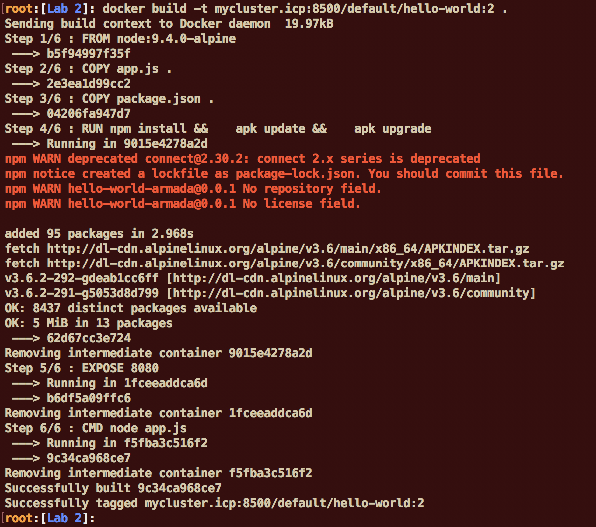
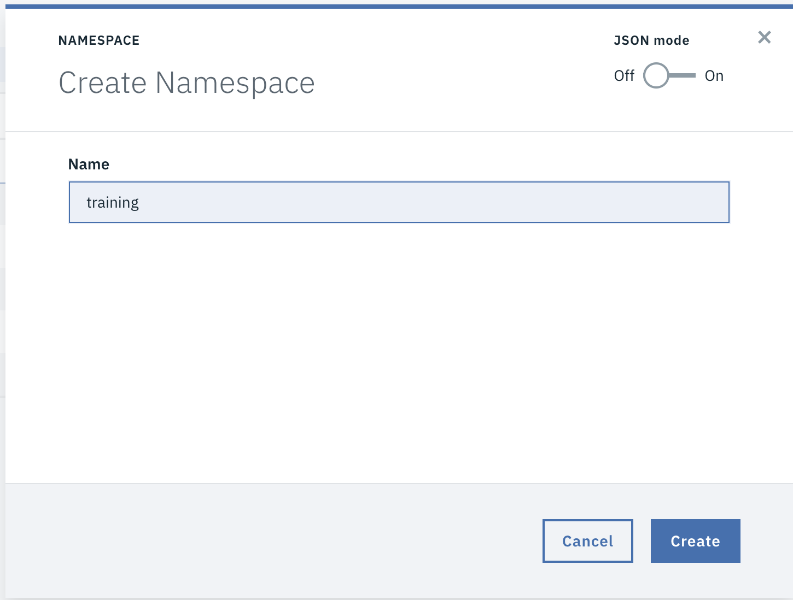
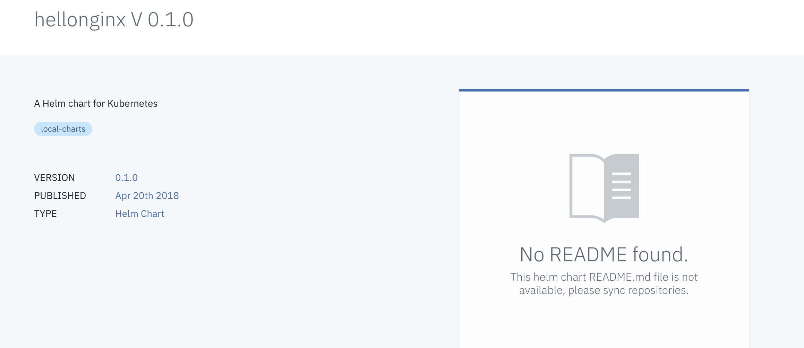

<div style="background-color:black;color:white; vertical-align: middle; text-align:center;font-size:250%; padding:10px; margin-top:100px"><b>
IBM Cloud Private - Helm Lab
 </b></a></div>

---


---

During this lab, we are going to install a helm client and configure it. Then we are going to install several sample charts to see how it works.

Helm helps you manage Kubernetes applications — Helm Charts helps you define, install, and upgrade even the most complex Kubernetes application.

Charts are easy to create, version, share, and publish — so start using Helm and stop the copy-and-paste madness.


## Table of Contents

---

- [Task 1: Helm Setup](#task-1--helm-setup)
  * [1. Connect as root to the **Ubuntu VM** using SSH or Putty](#1-connect-as-root-to-the---ubuntu-vm---using-ssh-or-putty)
  * [2. How to install helm tool ?](#2-how-to-install-helm-tool--)
  * [3. Download the Helm client from the master](#3-download-the-helm-client-from-the-master)
  * [4. Set an environment variable](#4-set-an-environment-variable)
  * [5. Configure the Cluster to set up Helm](#5-configure-the-cluster-to-set-up-helm)
  * [6. Initialize Helm](#6-initialize-helm)
  * [7. Access to the ICP container registry](#7-access-to-the-icp-container-registry)
- [Task 2: Installing a simple application](#task-2--installing-a-simple-application)
  * [1. Getting a new helm repo](#1-getting-a-new-helm-repo)
  * [2. View the available packages](#2-view-the-available-packages)
  * [3. Install a package](#3-install-a-package)
  * [4. List the package](#4-list-the-package)
  * [5. Delete the package](#5-delete-the-package)
- [Task 3: Understand the Kubernetes manifests](#task-3--understand-the-kubernetes-manifests)
  * [1. Build the docker image for the demo](#1-build-the-docker-image-for-the-demo)
  * [2. View the image in the console:](#2-view-the-image-in-the-console-)
  * [3. View a kubernetes manifest](#3-view-a-kubernetes-manifest)
- [Task 4: Define a Helm chart](#task-4--define-a-helm-chart)
  * [1. Initialize an empty chart directory](#1-initialize-an-empty-chart-directory)
  * [2. Look at the chart directory content.](#2-look-at-the-chart-directory-content)
  * [3. Check the chart](#3-check-the-chart)
- [Task 5: Using Helm](#task-5--using-helm)
  * [1. Create a new namespace in ICP:](#1-create-a-new-namespace-in-icp-)
  * [2. Install the chart to the training namespace](#2-install-the-chart-to-the-training-namespace)
  * [3. List the releases](#3-list-the-releases)
  * [4. List the deployments](#4-list-the-deployments)
  * [5. List the services](#5-list-the-services)
  * [6. List the pods](#6-list-the-pods)
  * [7. Upgrade](#7-upgrade)
- [Task 6: Defining the chart in the catalog](#task-6--defining-the-chart-in-the-catalog)
- [Congratulations](#congratulations)

---


# Task 1: Helm Setup


## 1. Connect as root to the **Ubuntu VM** using SSH or Putty

Be sure that you are connected to cluster. Use the kubectl command to check that you are connected:

`kubectl get nodes`

If you get an error, execute the following script that we created in the installation lab :

`~/connect2icp.sh`


## 2. How to install helm tool ?

Helm is a client/server application : Helm client and Tiller server.
Before we can run any chart with helm, we should proceed to some installation and configuration.


## 3. Download the Helm client from the master

```console
docker run -e LICENSE=accept --net=host -v /usr/local/bin:/data ibmcom/icp-helm-api:1.0.0 cp /usr/src/app/public/cli/linux-amd64/helm /data
```

This command will download the helm file to /usr/local/bin directory.

## 4. Set an environment variable

```console
export HELM_HOME=/root/.helm
```


## 5. Configure the Cluster to set up Helm

These 2 commands will first login to ICP cluster and configure your cluster.
cert.pem and key.pem certificates are added to the ~/.helm directory.


```console
ibmcloud pr login -a https://mycluster.icp:8443 --skip-ssl-validation
```

Results:
```console
root:[~]: ibmcloud pr login -a https://mycluster.icp:8443 --skip-ssl-validation
API endpoint: https://mycluster.icp:8443

Username> admin

Password>
Authenticating...
OK

Select an account:
1. mycluster Account (id-mycluster-account)
Enter a number> 1
Targeted account mycluster Account (id-mycluster-account)

Configuring helm and kubectl...
Configuring kubectl: /root/.bluemix/plugins/icp/clusters/mycluster/kube-config
Property "clusters.mycluster" unset.
Property "users.mycluster-user" unset.
Property "contexts.mycluster-context" unset.
Cluster "mycluster" set.
User "mycluster-user" set.
Context "mycluster-context" created.
Switched to context "mycluster-context".

Cluster mycluster configured successfully.

Configuring helm: /root/.helm
Helm configured successfully

OK

```


`ibmcloud pr cluster-config mycluster`

Results:
```console
root:[~]: ibmcloud pr cluster-config mycluster
Configuring kubectl: /root/.bluemix/plugins/icp/clusters/mycluster/kube-config
Property "clusters.mycluster" unset.
Property "users.mycluster-user" unset.
Property "contexts.mycluster-context" unset.
Cluster "mycluster" set.
User "mycluster-user" set.
Context "mycluster-context" created.
Switched to context "mycluster-context".

Cluster mycluster configured successfully.

Configuring helm: /root/.helm
Helm configured successfully

OK

```


## 6. Initialize Helm

`helm init --client-only`

Results:
```console
root:[~]: helm init --client-only
Creating /root/.helm/repository
Creating /root/.helm/repository/cache
Creating /root/.helm/repository/local
Creating /root/.helm/plugins
Creating /root/.helm/starters
Creating /root/.helm/cache/archive
Creating /root/.helm/repository/repositories.yaml
Adding stable repo with URL: https://kubernetes-charts.storage.googleapis.com
Adding local repo with URL: http://127.0.0.1:8879/charts
$HELM_HOME has been configured at /root/.helm.
Not installing Tiller due to 'client-only' flag having been set
Happy Helming!

```

After you have initialize helm client. Try the following command to see the version:

`helm version --tls`

Results :

```console
# helm version --tls
Client: &version.Version{SemVer:"v2.7.3+icp", GitCommit:"27442e4cfd324d8f82f935fe0b7b492994d4c289", GitTreeState:"dirty"}
Server: &version.Version{SemVer:"v2.7.3+icp", GitCommit:"27442e4cfd324d8f82f935fe0b7b492994d4c289", GitTreeState:"dirty"}

```
> The helm Client and server should be the same version (i.e. version 2.7.3+icp)

## 7. Access to the ICP container registry

For the next exercise, we need to get access to the IBM Cloud Private Registry. To do so,  login to the private registry:

`docker login mycluster.icp:8500 -u admin -p admin`


# Task 2: Installing a simple application


## 1. Getting a new helm repo

Add a Helm repository. To add the Kubernetes Incubator repository, run the following command:

```console
helm repo add incubator https://kubernetes-charts-incubator.storage.googleapis.com/
```

## 2. View the available packages

`helm search -l`

You should see a very long list of packages.

## 3. Install a package

In this command, package_name is the name for the package, and package_in_repo is the name of the available package to install. For example, to install the WordPress package, run the following command:

`helm install --name=my-wordpress stable/wordpress --tls`


## 4. List the package


`helm list --tls`

Results :

```
 NAME                REVISION    UPDATED                     STATUS      CHART              NAMESPACE
 my-wordpress        1           Wed Jun 28 22:15:13 2017    DEPLOYED    wordpress-0.6.5    default
 ```

## 5. Delete the package

`helm delete my-wordpress --purge --tls`

Results :

```
# helm delete my-wordpress --purge --tls
release "my-wordpress" deleted
```

Generally an helm chart is managing many pods, deployments, images, secrets, volumes and services. So deleting the chart is a quick way to clean up your work.

# Task 3: Understand the Kubernetes manifests


## 1. Build the docker image for the demo

Move to the Lab 2 directory:

`cd "/root/container-service-getting-started-wt/Lab 2"`


Then build the container:		

`docker build -t mycluster.icp:8500/default/hello-world:2 .`

`docker images mycluster.icp:8500/default/hello-world`

Result:




## 2. View the image in the console:

	- Select **Menu > Manage > Images**
	- Click on the `default/hello-world`
	- Check version 2 and Latest are in the Tags


## 3. View a kubernetes manifest

Open the **healthcheck.yml** file

`nano healthcheck.yml`

- the symbol `---` indicates a delimiter for a new resource
- Note that there are 2 resources being deployed here, a deployment and a service.
- The metadata section defines the attributes of the resource (name, annotation, label etc), while the spec specifies the detail of the resource

Review the deployment's manifest

```console
apiVersion: apps/v1beta1
kind: Deployment
metadata:
  name: hw-demo-deployment
spec:
  replicas: 3
  template:
    metadata:
      name: pod-liveness-http
      labels:
        run: hw-demo-health
        test: hello-world-demo
    spec:
      containers:
        - name: hw-demo-container
          image: "registry.ng.bluemix.net/<namespace>/hello-world:2"
          imagePullPolicy: Always
          livenessProbe:
            httpGet:
              path: /healthz
              port: 8080
            initialDelaySeconds: 5
            periodSeconds: 5
```

- Look into the deployment and see that the spec contains a ReplicaSet (see the `replicas` term) and that the ReplicaSet includes a Pod
- The Pod is defined as a template that contains the similar structure of metadata and specification
- The specification of the pod includes an array of containers that refers to an image.
- The livenessProbe and readinessProbe are checks that the kubernetes system would perform to check pod's health.

Review the **service's manifest**

```
apiVersion: v1
kind: Service
metadata:
  name: hw-demo-service
  labels:
    run: hw-demo-health
spec:
  type: NodePort
  selector:
    run: hw-demo-health
  ports:
   - protocol: TCP
     port: 8080
     nodePort: 30072
````

- The services defines the accessability of a pod. This service is of type NodePort, which exposes an internal Port (8080) into an externally accessible nodePort through the proxy node (here port 30072)
- How does a service know which pod are associated with it?  From the selector(s) that would select all pods with the same label(s) to be load balanced.

# Task 4: Define a Helm chart

Now that you have understood the structure of a kubernetes manifest file, you can start working with helm chart. Basically a helm chart is a collection of manifest files that are deployed as a group. The deployment includes the ability to perform variable substitution based on a configuration file.

## 1. Initialize an empty chart directory

`cd`

`helm create hellonginx`

## 2. Look at the chart directory content.

`cd hellonginx`

`tree .`


`nano values.yaml`

Look at **values.yaml** and **modify it**. Prepare to deploy **3** replicas of the nginx image.

Replace the service section and choose a port (like 30073 for instance) with the following code:

```console
  name: hellonginx-service
  type: NodePort
  externalPort: 80  
  internalPort: 80  
  nodePort: 30073
```


The main content for **values.yaml** is as follows:

```
# Default values for hellonginx.
# This is a YAML-formatted file.
# Declare variables to be passed into your templates.

replicaCount: 1

image:
  repository: nginx
  tag: stable
  pullPolicy: IfNotPresent

service:
  name: hellonginx-service
  type: NodePort
  externalPort: 80  
  internalPort: 80  
  nodePort: 30073

ingress:
  enabled: false
  annotations: {}
    # kubernetes.io/ingress.class: nginx
    # kubernetes.io/tls-acme: "true"
  path: /
  hosts:
    - chart-example.local
  tls: []
  #  - secretName: chart-example-tls
  #    hosts:
  #      - chart-example.local

resources: {}
  # We usually recommend not to specify default resources and to leave this as a conscious
  # choice for the user. This also increases chances charts run on environments with little
  # resources, such as Minikube. If you do want to specify resources, uncomment the following
  # lines, adjust them as necessary, and remove the curly braces after 'resources:'.
  # limits:
  #  cpu: 100m
  #  memory: 128Mi
  # requests:
  #  cpu: 100m
  #  memory: 128Mi

nodeSelector: {}

tolerations: []

affinity: {}
````


Review deployment template:

`nano /root/hellonginx/templates/deployment.yaml`

Don't change anything.

```
apiVersion: apps/v1beta2
kind: Deployment
metadata:
  name: {{ template "hellonginx.fullname" . }}
  labels:
    app: {{ template "hellonginx.name" . }}
    chart: {{ template "hellonginx.chart" . }}
    release: {{ .Release.Name }}
    heritage: {{ .Release.Service }}
spec:
  replicas: {{ .Values.replicaCount }}
  selector:
    matchLabels:
      app: {{ template "hellonginx.name" . }}
      release: {{ .Release.Name }}
  template:
    metadata:
      labels:
        app: {{ template "hellonginx.name" . }}
        release: {{ .Release.Name }}
    spec:
      containers:
        - name: {{ .Chart.Name }}
          image: "{{ .Values.image.repository }}:{{ .Values.image.tag }}"
          imagePullPolicy: {{ .Values.image.pullPolicy }}
          ports:
            - name: http
              containerPort: 80
              protocol: TCP
          livenessProbe:
            httpGet:
              path: /
              port: http
          readinessProbe:
            httpGet:
              path: /
              port: http
          resources:
{{ toYaml .Values.resources | indent 12 }}
    {{- with .Values.nodeSelector }}
      nodeSelector:
{{ toYaml . | indent 8 }}
    {{- end }}
    {{- with .Values.affinity }}
      affinity:
{{ toYaml . | indent 8 }}
    {{- end }}
    {{- with .Values.tolerations }}
      tolerations:
{{ toYaml . | indent 8 }}
    {{- end }}
```


Review the **service template**:

`nano /root/hellonginx/templates/service.yaml`

Change the **-port section** with the following code:

```console
    - port: {{ .Values.service.externalPort }}
      targetPort: {{ .Values.service.internalPort }}
      protocol: TCP
      nodePort: {{ .Values.service.nodePort }}
      name: {{ .Values.service.name }}
```

So the service should look as follows:

```
apiVersion: v1
kind: Service
metadata:
  name: {{ template "fullname" . }}
  labels:
    app: {{ template "name" . }}
    chart: {{ .Chart.Name }}-{{ .Chart.Version | replace "+" "_" }}
    release: {{ .Release.Name }}
    heritage: {{ .Release.Service }}
spec:
  type: {{ .Values.service.type }}
  ports:
    - port: {{ .Values.service.externalPort }}
      targetPort: {{ .Values.service.internalPort }}
      protocol: TCP
      nodePort: {{ .Values.service.nodePort }}
      name: {{ .Values.service.name }}
  selector:
    app: {{ template "name" . }}
    release: {{ .Release.Name }}
```
## 3. Check the chart

Go back to the hellonginx path and check the validity of the helm chart.

`cd /root/hellonginx`

`helm lint`


# Task 5: Using Helm

The helm chart that we created in the previous section that has been verified now can be deployed.

## 1. Create a new namespace in ICP:

- Open a  Web browser from the application launcher
- Go to `https://mycluster.icp:8443/`
- Login as `admin` with the password of `admin`
- Go to **Menu > Manage**

- Select __Namespaces__ then click __New namespace__<br>


  - Specify the namespace of `training` and click __Add namespace__.<br>



## 2. Install the chart to the training namespace

Type the following command and don't forget the dot at the end:

`helm install --name hellonginx --namespace training --tls .`

Results:
```console
root:[hellonginx]: helm install --name hellonginx --namespace training --tls .
NAME:   hellonginx
LAST DEPLOYED: Thu Apr 19 23:49:47 2018
NAMESPACE: training
STATUS: DEPLOYED

RESOURCES:
==> v1beta2/Deployment
NAME        DESIRED  CURRENT  UP-TO-DATE  AVAILABLE  AGE
hellonginx  1        1        1           0          0s

==> v1/Service
NAME        TYPE      CLUSTER-IP  EXTERNAL-IP  PORT(S)       AGE
hellonginx  NodePort  10.0.0.131  <none>       80:30073/TCP  0s


NOTES:
1. Get the application URL by running these commands:
  export NODE_PORT=$(kubectl get --namespace training -o jsonpath="{.spec.ports[0].nodePort}" services hellonginx)
  export NODE_IP=$(kubectl get nodes --namespace training -o jsonpath="{.items[0].status.addresses[0].address}")
  echo http://$NODE_IP:$NODE_PORT
```
At the end of the answer, copy & paste the last 3 lines:

```console
root:[hellonginx]:   export NODE_PORT=$(kubectl get --namespace training -o jsonpath="{.spec.ports[0].nodePort}" services hellonginx)
root:[hellonginx]:   export NODE_IP=$(kubectl get nodes --namespace training -o jsonpath="{.items[0].status.addresses[0].address}")
root:[hellonginx]:   echo http://$NODE_IP:$NODE_PORT
http://192.168.225.132:30073
```
So that you should see the url:
`http://192.168.225.132:30073`

Try this url and get the nginx hello:


## 3. List the releases

`helm list --tls`

Results:

```console
# helm list --tls
NAME      	REVISION	UPDATED                 	STATUS  	CHART                	NAMESPACE
hellonginx	1       	Thu Apr 19 23:49:47 2018	DEPLOYED	hellonginx-0.1.0     	training
my-release	1       	Tue Apr 17 20:08:44 2018	DEPLOYED	ibm-jenkins-dev-1.0.0	default  
```


## 4. List the deployments

`kubectl get deployments --namespace=training`

```console
# kubectl get deployments --namespace=training
NAME         DESIRED   CURRENT   UP-TO-DATE   AVAILABLE   AGE
hellonginx   1         1         1            1           9m
```

## 5. List the services

`kubectl get services --namespace=training`

```console
# kubectl get services --namespace=training
NAME         TYPE       CLUSTER-IP   EXTERNAL-IP   PORT(S)        AGE
hellonginx   NodePort   10.0.0.131   <none>        80:30073/TCP   10m
```

Locate the line port 80:300073.  

## 6. List the pods

`kubectl get pods --namespace=training`

**Results**

```console
root:[hellonginx]: kubectl get pods --namespace=training
NAME                          READY     STATUS    RESTARTS   AGE
hellonginx-6bcd9f4578-zqt6r   1/1       Running   0          11m
```

## 7. Upgrade

We now want to change the number of replicas to 3:

`helm  upgrade hellonginx . --tls`

**Results**
```console
root:[hellonginx]: helm  upgrade hellonginx . --tls
Release "hellonginx" has been upgraded. Happy Helming!
LAST DEPLOYED: Fri Apr 20 00:06:55 2018
NAMESPACE: training
STATUS: DEPLOYED

RESOURCES:
==> v1/Service
NAME        TYPE      CLUSTER-IP  EXTERNAL-IP  PORT(S)       AGE
hellonginx  NodePort  10.0.0.131  <none>       80:30073/TCP  17m

==> v1beta2/Deployment
NAME        DESIRED  CURRENT  UP-TO-DATE  AVAILABLE  AGE
hellonginx  3        3        3           1          17m


NOTES:
1. Get the application URL by running these commands:
  export NODE_PORT=$(kubectl get --namespace training -o jsonpath="{.spec.ports[0].nodePort}" services hellonginx)
  export NODE_IP=$(kubectl get nodes --namespace training -o jsonpath="{.items[0].status.addresses[0].address}")
  echo http://$NODE_IP:$NODE_PORT

```


# Task 6: Defining the chart in the catalog

A good idea is to define the chart in the catalog.

First, package the helm chart as a tgz file:

`cd`

`helm package hellonginx`

**Results**
```console
root:[~]: helm package hellonginx
Successfully packaged chart and saved it to: /root/hellonginx-0.1.0.tgz
````

**Login**to the master:

`ibmcloud pr login -a https://mycluster.icp:8443 --skip-ssl-validation`

Then, use the "bx pr" command to load the chart:

`ibmcloud pr load-helm-chart --archive /root/hellonginx-0.1.0.tgz`

**Results**
```console
#  ibmcloud pr load-helm-chart --archive /root/hellonginx-0.1.0.tgz
Loading helm chart
Loaded helm chart

Synch charts
Synch started
OK
```


Leave the terminal and login to the ICP console with admin/admin :

- Select **Catalog** on the top right side of the ICP console

- Find the `hellonginx` chart from AppCenter


- Click on the `hellonginx` chart to get access to configuration.



- Click configure to see the parameters:


Click **Install** to see the results.

Of course, you can customize the README.MD and add an icon to make the chart more appealing.

# Congratulations

You successfully created and managed charts to deploy applications on the IBM Cloud Private.


---

<div style="background-color:black;color:white; vertical-align: middle; text-align:center;font-size:250%; padding:10px; margin-top:100px"><b>
IBM Cloud Private - Helm Lab
 </b></a></div>
