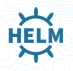
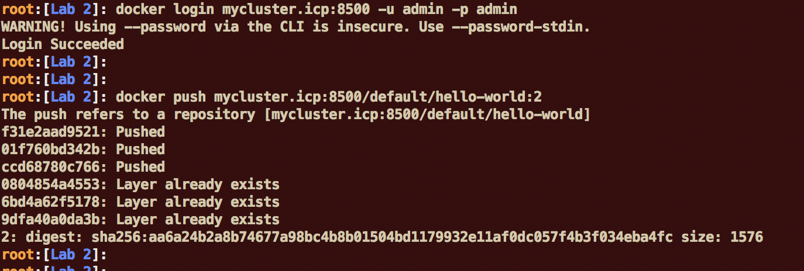
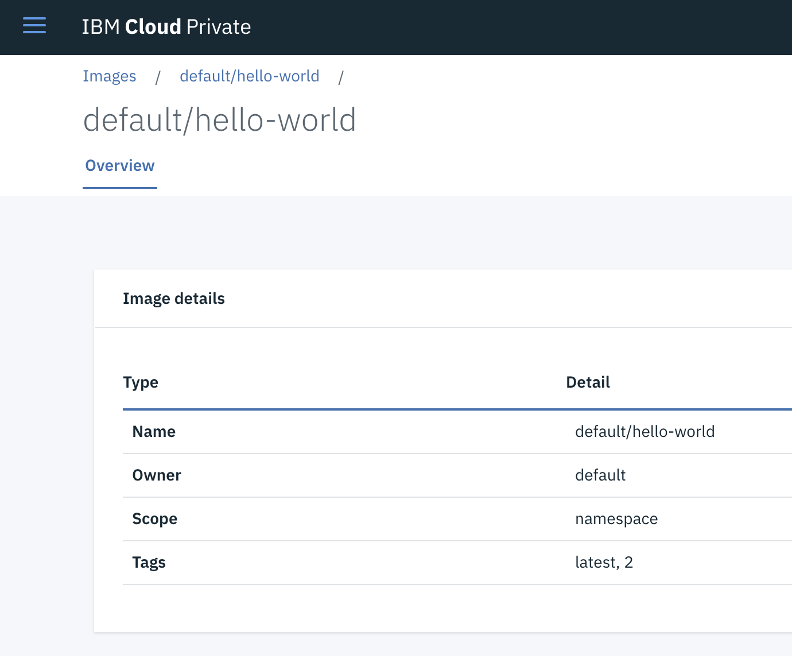
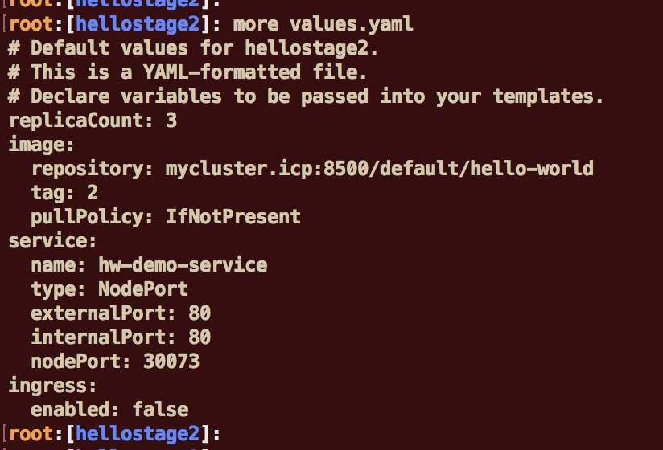
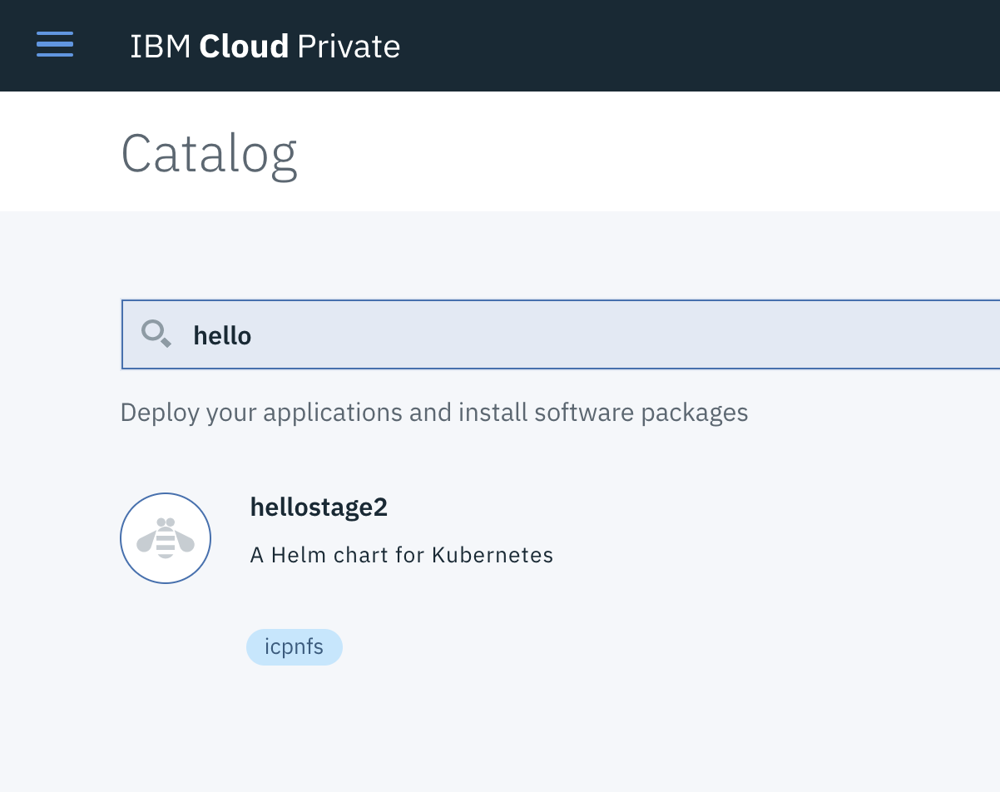
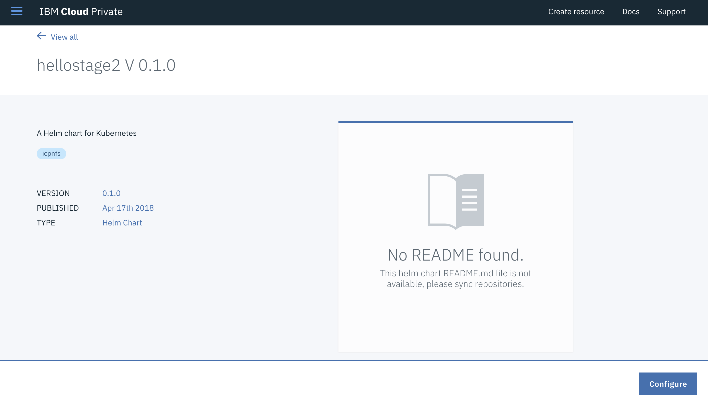

<div style="background-color:black;color:white; vertical-align: middle; text-align:center;font-size:250%; padding:10px; margin-top:100px"><b>
IBM Cloud Private - Helm Lab
 </b></a></div>

---


# Helm Lab

During this lab, we are going to install a helm client and configure it. Then we are going to install several sample charts to see how it works.

Helm helps you manage Kubernetes applications — Helm Charts helps you define, install, and upgrade even the most complex Kubernetes application.

Charts are easy to create, version, share, and publish — so start using Helm and stop the copy-and-paste madness.




Table of Contents

---

[[toc]]

---


# Task 1: Helm Setup


## 1. Connect as root to the **Ubuntu VM** using SSH or Putty 

Be sure that you are connected to cluster. Use the kubectl command to check that you are connected:

`kubectl get nodes`


If you get an error, go back to the installation lab and copy&paste the 5 lines from the console into the console.


## 2. Install helm tool

Helm is a client/server application : Helm client and Tiller server. 
Before we can run any chart with helm, we should proceed to some installation and change. 
   
## 3. Get the certificates

Use the following command to get the certificates: 

```console
curl -sL https://raw.githubusercontent.com/kubernetes/helm/master/scripts/get | bash
```

## 4. Download the Helm client from the master

```console
wget https://mycluster.icp:8443//helm-api/cli/linux-amd64/helm --no-check-certificate
```

This command will download the helm file to current directory.

## 5. Copy helm to /usr/local/bin

```
chmod +x helm

mv ./helm /usr/local/bin/helm
```
   

## 6. Configure the Cluster to set up Helm

These 2 commands will first login to ICP cluster and then it will  configure your cluster. cert.pem and key.pem certificates are added to the ~/.helm directory.


```console
bx pr login -a https://159.122.2.109:8443 --skip-ssl-validation
```

Results:
```console
root:[~]: bx pr login -a https://159.122.2.109:8443 --skip-ssl-validation
API endpoint: https://159.122.2.109:8443

Username> admin

Password> 
Authenticating...
OK

Select an account:
1. mycluster Account (id-mycluster-account)
Enter a number> 1
Targeted account: mycluster Account (id-mycluster-account)
```


`bx pr cluster-config mycluster`

Results:
```console
root:[~]: bx pr cluster-config mycluster
Configuring kubectl: /root/.bluemix/plugins/icp/clusters/mycluster/kube-config
Cluster "mycluster" set.
Cluster "mycluster" set.
User "mycluster-user" set.
Context "mycluster-context" modified.
Context "mycluster-context" modified.
Switched to context "mycluster-context".

OK
Cluster mycluster configured successfully.
```


## 7. Initialise Helm

`helm init --client-only`

Results:
```console
root:[~]: helm init --client-only
$HELM_HOME has been configured at /root/.helm.
Not installing Tiller due to 'client-only' flag having been set
Happy Helming!
```

After you have initialize helm client. Try the following command to see the version:

`helm version --tls`

> Note: some commands are using the **--tls** parameter for security (tls protocol) reason when there is an interaction between the Helm client and the Tiller server. 

If the client and the tiller versions are different then do the following :
- upgrade tiller if its version is lower compared to the client

`helm init --upgrade`

- or downgrade the tiller version instead (yes this is a "--force-upgrate" to **downgrade** tiller)

`helm init --upgrade --force-upgrade`

Then retry :
`helm version --tls`

You should get the following result:
```
root:[Lab 2]: helm version --tls
Client: &version.Version{SemVer:"v2.7.2+icp", GitCommit:"d41a5c2da480efc555ddca57d3972bcad3351801", GitTreeState:"dirty"}
Server: &version.Version{SemVer:"v2.7.2", GitCommit:"8478fb4fc723885b155c924d1c8c410b7a9444e6", GitTreeState:"clean"}
```

## 8. Access to the ICP container registry

For the next exercise, we need to get access to the IBM Cloud Private Registry. To do so,  login to the private registry:

`docker login mycluster.icp:8500 -u admin -p admin`



# Task 2: Installing a simple application


## 1. Getting a new helm repo

Add a Helm repository. To add the Kubernetes Incubator repository, run the following command:

```console
helm repo add incubator https://kubernetes-charts-incubator.storage.googleapis.com/
```

## 2. View the available packages

`helm search -l`

You should see a very long list of packages.

## 3. Install a package

In this command, package_name is the name for the package, and package_in_repo is the name of the available package to install. For example, to install the WordPress package, run the following command:

`helm install --name=my-wordpress stable/wordpress --tls`


## 4. List the package


`helm list --tls`

```
 NAME                REVISION    UPDATED                     STATUS      CHART              NAMESPACE
 my-wordpress        1           Wed Jun 28 22:15:13 2017    DEPLOYED    wordpress-0.6.5    default
 ```
 
## 5. Delete the package

`helm delete my-wordpress --purge --tls`

```
root:[Lab 2]: helm delete my-wordpress --purge --tls
release "my-wordpress" deleted
```

Generally an helm chart is managing many pods, deployments, images, secrets, volumes and services. So deleting the chart is a quick way to clean up your work.

# Task 3: Understand the Kubernetes manifests


## 1. Build the docker image for the demo

Move to the Lab 2 directory: 

`cd "/root/container-service-getting-started-wt/Lab 2"`


Then build the container:		

`docker build -t mycluster.icp:8500/default/hello-world:2 .`

`docker images mycluster.icp:8500/default/hello-world`

Result:


## 2. View the image in the console:

	- Select **Menu > Catalog > Images**
	- Click on the `default/hello-world`
	- Check version 2 is in the Tags



## 3. View a kubernetes manifest

Open the **healthcheck.yml** file

`nano healthcheck.yml`

- Indicates that the symbol `---` indicates a delimiter for a new resource
- Note that there are 2 resources being deployed here, a deployment and a service.
- The metadata section defines the attributes of the resource (name, annotation, label etc), while the spec specifies the detail of the resource

Review the deployment's manifest

```console
apiVersion: apps/v1beta1
kind: Deployment
metadata:
  name: hw-demo-deployment
spec:
  replicas: 3
  template:
    metadata:
      name: pod-liveness-http
      labels:
        run: hw-demo-health
        test: hello-world-demo
    spec:
      containers:
        - name: hw-demo-container
          image: "registry.ng.bluemix.net/<namespace>/hello-world:2"
          imagePullPolicy: Always
          livenessProbe:
            httpGet:
              path: /healthz
              port: 8080
            initialDelaySeconds: 5
            periodSeconds: 5
```

- Look into the deployment and see that the spec contains a ReplicaSet (see the `replicas` term) and that the ReplicaSet includes a Pod
- The Pod is defined as a template that contains the similar structure of metadata and specification
- The specification of the pod includes an array of containers that refers to an image.
- The livenessProbe and readinessProbe are checks that the kubernetes system would perform to check pod's health.

Review the **service's manifest**

```
apiVersion: v1
kind: Service
metadata:
  name: hw-demo-service
  labels:
    run: hw-demo-health
spec:
  type: NodePort
  selector:
    run: hw-demo-health
  ports:
   - protocol: TCP
     port: 8080
     nodePort: 30072
````

- The services defines the accessability of a pod. This service is of type NodePort, which exposes an internal Port (8080) into an externally accessible nodePort through the proxy node (here port 30072)
- How does a service know which pod are associated with it?  From the selector(s) that would select all pods with the same label(s) to be load balanced.

# Task 3: Define a Helm chart

Now that you have understood the structure of a kubernetes manifest file, you can start working with helm chart. Basically a helm chart is a collection of manifest files that are deployed as a group. The deployment includes the ability to perform variable substitution based on a configuration file.

## 1. Initialize an empty chart directory

`cd`

`helm create hellostage2`
        
## 2. Look at the chart directory content.
       
`cd hellostage2`

`tree .`


`nano values.yaml`

Look at **values.yaml** and **modify it**. Prepare to deploy 3 replicas using the image that was created based on the tutorial. Specify the port (if you have not delete the pod from the tutorial, you can use a different port to be exposed). 

The main content for values.yaml is as follows:

```
replicaCount: 3
image:
  repository: mycluster.icp:8500/default/hello-world
  tag: 2
  pullPolicy: IfNotPresent
service:
  name: hw-demo-service
  type: NodePort
  externalPort: 8080
  internalPort: 8080
  nodePort: 30073
ingress:
  enabled: false
````




Review deployment template: 

`nano /root/hellostage2/templates/deployment.yaml`

modify livenessProbe to get `/healthz` and remove the readinessProbe and resources directives.

```
apiVersion: extensions/v1beta1
kind: Deployment
metadata:
  name: {{ template "fullname" . }}
  labels:
    app: {{ template "name" . }}
    chart: {{ .Chart.Name }}-{{ .Chart.Version | replace "+" "_" }}
    release: {{ .Release.Name }}
    heritage: {{ .Release.Service }}
spec:
  replicas: {{ .Values.replicaCount }}
  template:
    metadata:
      labels:
        app: {{ template "name" . }}
        release: {{ .Release.Name }}
    spec:
      containers:
        - name: {{ .Chart.Name }}
          image: "{{ .Values.image.repository }}:{{ .Values.image.tag }}"
          imagePullPolicy: {{ .Values.image.pullPolicy }}
          ports:
            - containerPort: {{ .Values.service.internalPort }}
          livenessProbe:
            httpGet:
              path: /healthz
              port: {{ .Values.service.internalPort }}
```


Review service template: add nodePort directive under ports

```
apiVersion: v1
kind: Service
metadata:
  name: {{ template "fullname" . }}
  labels:
    app: {{ template "name" . }}
    chart: {{ .Chart.Name }}-{{ .Chart.Version | replace "+" "_" }}
    release: {{ .Release.Name }}
    heritage: {{ .Release.Service }}
spec:
  type: {{ .Values.service.type }}
  ports:
    - port: {{ .Values.service.externalPort }}
      targetPort: {{ .Values.service.internalPort }}
      protocol: TCP
      nodePort: {{ .Values.service.nodePort }}
      name: {{ .Values.service.name }}
  selector:
    app: {{ template "name" . }}
    release: {{ .Release.Name }}
```
## 3. Check the chart

Go back to the helloStage2 path and check the validity of the helm chart.

`cd ..`

`helm lint`


# Task 4: Using Helm

The helm chart that we created in the previous section that has been verified now can be deployed.

## 1. Create a new namespace in ICP:

- Open a  Web browser from the application launcher
- Go to `https://mycluster.icp:8443/`
- Login as `admin` with the password of `admin`
- Go to **Menu > Manage**

  - Select __Namespaces__ then click __New namespace__<br>


  - Specify the namespace of `training` and click __Add namespace__.<br>


## 2. Install the chart to the training namespace

`helm install hellostage2 --namespace training --tls`

Results:
```console
LAST DEPLOYED: Tue Apr 17 06:13:22 2018
NAMESPACE: training
STATUS: DEPLOYED

RESOURCES:
==> v1/Service
NAME                         TYPE      CLUSTER-IP  EXTERNAL-IP  PORT(S)       AGE
terrifying-mule-hellostage2  NodePort  10.0.0.62   <none>       80:30073/TCP  0s

==> v1beta1/Deployment
NAME                         DESIRED  CURRENT  UP-TO-DATE  AVAILABLE  AGE
terrifying-mule-hellostage2  3        3        3           0          0s

==> v1/Pod(related)
NAME                                          READY  STATUS             RESTARTS  AGE
terrifying-mule-hellostage2-744f6ffb65-g4dwn  0/1    ContainerCreating  0         0s
terrifying-mule-hellostage2-744f6ffb65-qcz7b  0/1    ContainerCreating  0         0s
terrifying-mule-hellostage2-744f6ffb65-sjhsf  0/1    ContainerCreating  0         0s


NOTES:
1. Get the application URL by running these commands:
  export NODE_PORT=$(kubectl get --namespace training -o jsonpath="{.spec.ports[0].nodePort}" services terrifying-mule-hellostage2)
  export NODE_IP=$(kubectl get nodes --namespace training -o jsonpath="{.items[0].status.addresses[0].address}")
  echo http://$NODE_IP:$NODE_PORT
```

## 3. List the releases 

(in this example,  the name of our release is `irreverant-duck`)

`helm list --tls`

Results:

```console
NAME           	REVISION	UPDATED                 	STATUS  	CHART                               	NAMESPACE
microfabric    	1       	Sat Apr  7 21:24:38 2018	DEPLOYED	ibm-microservicebuilder-fabric-2.1.0	default  
monitoricp     	1       	Sat Apr  7 20:59:28 2018	DEPLOYED	ibm-icpmonitoring-1.0.0             	default  
terrifying-mule	1       	Tue Apr 17 06:13:22 2018	DEPLOYED	hellostage2-0.1.0                   	training 
vigilant-peahen	1       	Mon Apr  9 23:05:05 2018	DEPLOYED	demoapp-0.1.0                       	training 
```
Locate the hellostage2 (because we didn't specify a --name, it was given "terrifying mule" )

## 4. List the deployments

`kubectl get deployments --namespace=training`

```console
root:[~]: kubectl get deployments --namespace=training
NAME                          DESIRED   CURRENT   UP-TO-DATE   AVAILABLE   AGE
terrifying-mule-hellostage2   3         3         3            3           4m
vigilant-peahen-demoapp       1         1         1            1           7d
```

## 5. List the services

`kubectl get services --namespace=training`

```console
root:[~]: kubectl get services --namespace=training
NAME                          TYPE        CLUSTER-IP   EXTERNAL-IP   PORT(S)        AGE
terrifying-mule-hellostage2   NodePort    10.0.0.62    <none>        80:30073/TCP   5m
vigilant-peahen-demoapp       ClusterIP   10.0.0.140   <none>        80/TCP         7d
```

Locate the line port 80:300073.  

Try opening `http://mycluster.icp:30073` in your browser.


# Task 5: Defining the chart in the catalog

Package the helm chart as a tgz file:

`helm package hellostage2`

Use helm to serve a chart repository from the ICP master node on port 8879

`helm serve --address mycluster.icp:8879`

Leave the terminal and login to the ICP console with admin/admin :

- Select **Menu > Manage > Repositories**

- Click __Add repository__ and put in the `icpnfs` repository and its URL  `http://mycluster.icp:8879`

- Click __Sync up repositories__ and confirm by clicking __Sync Up__.

- Select __Menu > Catalog__

- Find the `hello` chart from AppCenter



- Click on the `hello` chart to get access to configuration.



Of course, you can customize the README.MD and add an icon to make the chart more appealing. 

# Congratulations

You successfully create and manage charts to deploy applications on the IBM Cloud Private. 


---

<div style="background-color:black;color:white; vertical-align: middle; text-align:center;font-size:250%; padding:10px; margin-top:100px"><b>
IBM Cloud Private - Helm Lab
 </b></a></div>
